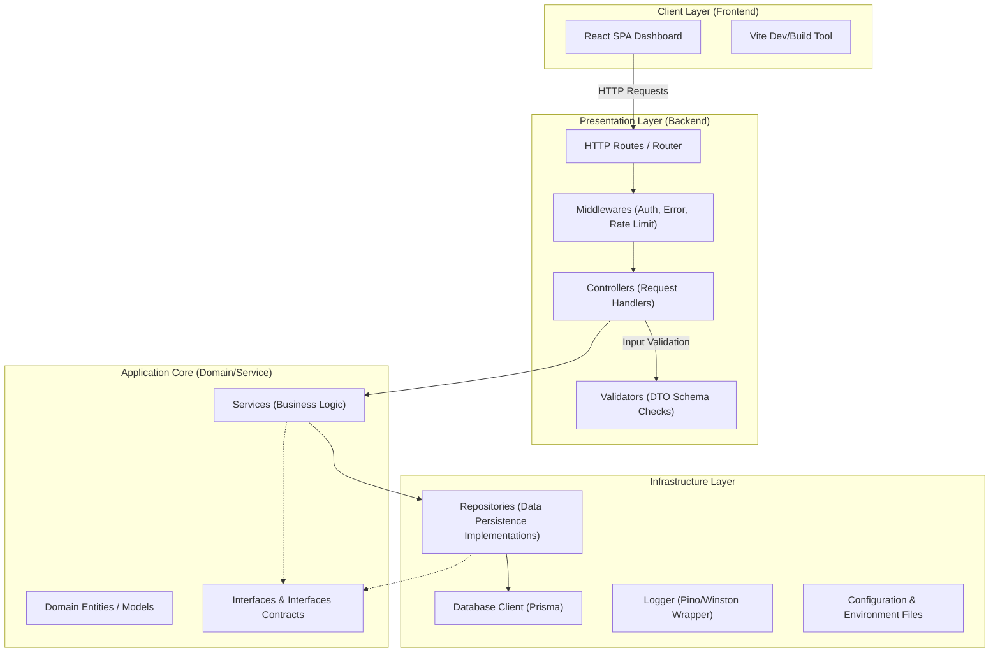

# System Architecture

This document describes the software architecture for the AI-Powered URL Shortener Dashboard, following the principles of Clean Architecture.

## Architecture Block Diagram

## Layer Breakdown

### 1. Presentation Layer (`src/controllers`, `src/routes`, `src/middleware`)
- Exposes REST API endpoints.
- Validates requests before executing core logic.
- Converts protocol-specific models (HTTP requests/responses) to domain entities.

### 2. Service/Domain Layer (`src/services`, `src/models`, `src/interfaces`)
- Contains all pure business logic and use cases.
- Defines interfaces for dependencies (e.g. database access, logging).
- Pure TypeScript, decoupled from any database or network framework.

### 3. Infrastructure Layer (`src/repositories`, `database`, `prisma`)
- Implements application core interfaces.
- Interacts with external systems (Database, Cache, Message Queues).
- Handles data serialization/deserialization to DB models.
